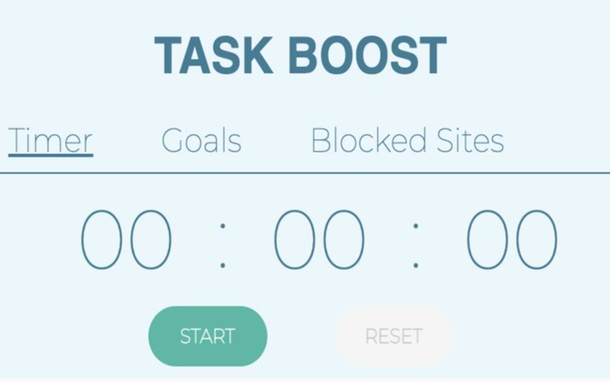
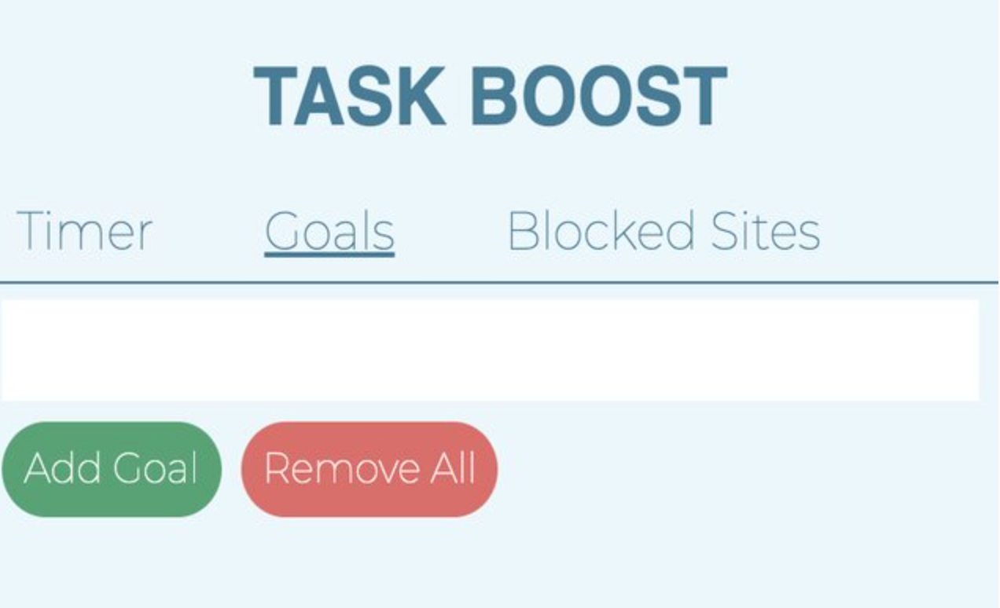
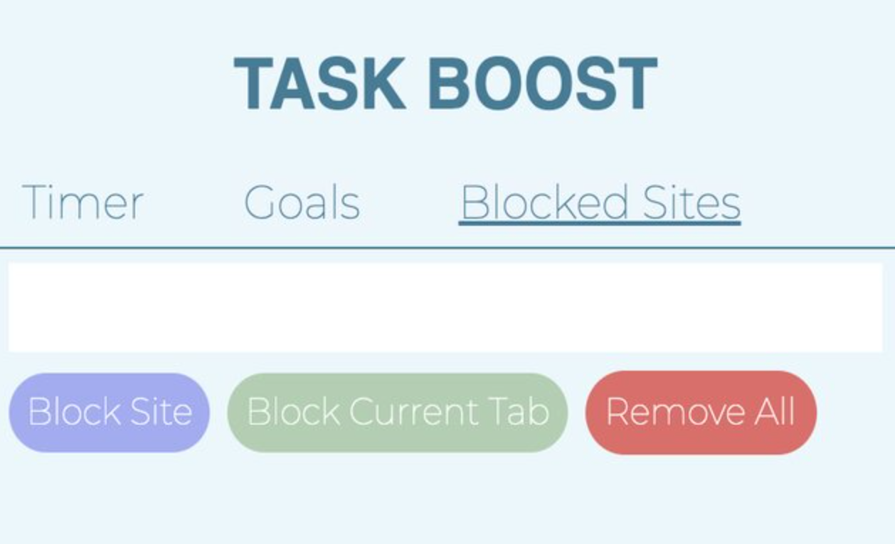

<!-- PROJECT LOGO -->
 

  

<h3 align="center">Task Boost</h3>

<!-- ABOUT THE PROJECT -->
## About The Project
As a fan of the Pomodoro productivity method, I would do my best to set strict time-based goals and avoid distractions as much as possible. However, between work periods, I'd find it frustrating to shuffle between managing a timer and keeping track of my goals. Also, it could get difficult at times to stay completely focused on one task with the whole Internet at my hands. Therefore I decided to build **Task Boost**, a user-friendly Chrome extension that features an all-in-one timer, to-do list, and website blocker.

### Built With

* ![NodeJS][Node.js]
* ![HTML5][HTML-URL]
* ![CSS3][CSS-URL]

<!-- USAGE EXAMPLES -->
## Usage
This extension can be downloaded on the Chrome Web Store <a href='https://chrome.google.com/webstore/detail/task-boost-an-easy-to-use/gldbghjkejlfhbhgeofigdafgedjdicd'>here</a>

User Experience Layout:
 

<!-- MARKDOWN LINKS & IMAGES -->
<!-- https://www.markdownguide.org/basic-syntax/#reference-style-links -->
[Node.js]: https://img.shields.io/badge/node.js-6DA55F?style=for-the-badge&logo=node.js&logoColor=white
[HTML-URL]: https://img.shields.io/badge/html5-%23E34F26.svg?style=for-the-badge&logo=html5&logoColor=white
[CSS-URL]: https://img.shields.io/badge/css3-%231572B6.svg?style=for-the-badge&logo=css3&logoColor=white

(<a href="#readme-top">back to top</a>)
